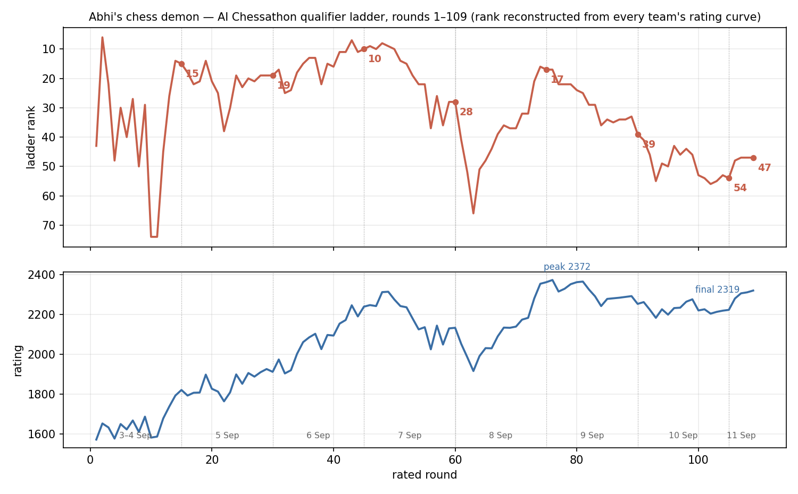

# Abhi's Chess Demon — a pure-Python chess engine for the AI Chessathon ladder

**Team:** Dark Sister — Abhijith Pradeep (Imperial College London) · **Event:** AI Chessathon,
3–11 September 2026 · **Builds:** 24 (21 uploaded and validated)

**Qualifier ladder: #47 of 465 — top 10%**, rating 2319 (peak 2372), 35W 37D 31L ·
**Final qualification Swiss: #28 of 334**, 9.0/13 (7W 4D 2L)

This repository is the complete record of one competition entry: the engine, the
training pipeline, the test tooling, and — in `docs/VERSIONS.md` — every build with
what it changed and what it measured, including the changes that failed and were
reverted. The forked starter this grew from is described at the bottom.

---

## 1. The problem

AI Chessathon pits chess agents against each other on a ladder with a fixed
contract: a single `agent.py` exposing `get_move(fen, time_left_ms) -> str`,
run as plain Python (numpy, numba, python-chess, CPU torch preinstalled; no
native binaries; no existing engines; self-trained models only) on **one CPU
core with 2 GB**, at **120 s + 0.5 s per move**, with a **90 s import budget** and
the process **suspended while the opponent thinks**. Games start from curated
opening positions that are not published; a game still running at 600 plies is
a draw. Six uploads a day; hourly rated rounds 08:00–22:00 BST.

So the whole engine — move generation, search and evaluation — had to be Python
that numba compiles at import time, warmed up inside the init budget, and fast
enough to search meaningfully at ~2–3 seconds a move.

## 2. What was built (`nbchess/`)

**Board (`core.py`).** Magic-bitboard move generation, copy-make with a 22-slot
state row per ply, Zobrist hashing, and material / piece-square / phase sums
kept incrementally in `make()`.

**Search (`search.py`).** Iterative deepening with aspiration windows around a
principal-variation search; packed transposition table (key and data in one
`uint64` pair per slot, 4M entries); null-move pruning; late-move reductions
tuned by history; late-move, reverse-futility, futility and static-exchange
pruning; singular extensions; internal iterative reduction; check extensions;
killer, counter and history move ordering; quiescence search with check
evasions and a captures-only generator; repetition and fifty-move handling;
the referee's 600-ply draw modelled by fading the evaluation towards zero.
An iteration cut off by the clock keeps the moves it finished.

**Evaluation (`nnue.py`, `search.py`).** A residual NNUE: 768 piece-square
inputs per perspective, 256 hidden units, three output buckets by piece count,
added on top of a tapered hand evaluation (PeSTO tables, mobility, pawn
structure, king shelter and attack units, threats, rook files) whose terms
were Texel-tuned on Stockfish-labelled positions. Accumulators are updated
incrementally in one fused pass per move. Weights ship as a `.safetensors`
file read with numpy alone.

**Clock (`engine.py`).** Remaining time spread over `max(30, 60 − ply/2)` moves
plus 60% of the increment, a hard ceiling of half the clock, and a node cap as
a backstop. **Contempt** 60: a draw scores −60 cp, so the engine plays on in
level positions.

**Opening book (`book.json`, `tools/build_book*.py`).** 858 positions — every
start position and opening line seen in our own rated games, plus the listed
starts — each answered by the engine itself after 30–40 s of thought.

Speed: roughly 600–700k nodes/second on one core; depth 10–12 in the 2–3 s the
clock allows.

## 3. How every change was decided

From v4 on, nothing shipped without beating the current build in a measured
match. `tools/ab.py` imports two copies of the engine into one process (so the
numba compile is paid once), plays them from the rated openings with both
colours at 60 ms/move, and reports Elo with a 95% interval: ±40 at 300 games,
±28 at 600, ±20 at 1200. Clock changes were measured on a compressed real clock
(`--clock --clock-scale 6`, which plays 120+0.5 as 20+0.083 while every
allocator constant applies as in a real game) and confirmed with real-clock
games. Every upload also passed a 16-point compliance check against the
platform contract, a full harness game from the unzipped submission, and an
init-time check.

The one time this discipline lapsed — three clock changes on 7 Sep shipped on
game evidence rather than a match — the ladder position went from 8th to 34th
in a day, and the changes were measured, found harmful, and reverted (v19).

## 4. Timeline

| date | what happened |
|---|---|
| 29 Aug – 2 Sep | Starter harness; bitboard engine; tapered evaluation; calibration against a rated reference. |
| 3 Sep | **v1** uploaded: PVS + hand eval, ~2400 implied vs a limited Stockfish. Ladder W W D L W L W. |
| 4 Sep | **v2** SEE (+75), futility; **v3** pondering (+109, later banned by a rules change), aspiration and clock safety. Self-play labelling pipeline written; laptop starts producing Stockfish-labelled positions. |
| 5 Sep | **v4** first residual NNUE (+40 over 600 games); **v5–v9**: bigger nets, clean holdout, moves-to-go clock, output damping, singular extensions, partial-iteration policy. |
| 6 Sep | **v10** 2.9M-position net with output buckets (+50); **v11–v14** clock 60/30, output gain 0.85 (+37), 600-ply rule, mirror augmentation (+24). **8th on the ladder.** |
| 7 Sep | **v15–v18**: 256-wide net, +35% node speed (+81/+48) — but two unmeasured clock changes lost games; **34th**. **v19** restores the clock (+21/+54 vs v14). |
| 8 Sep | **v20** opening book; **v21** +25% node speed with bit-identical search (+33/+45); recovery to ~26th. Correction history, cut-node LMR, a 512-wide net, clock variants all measured and rejected. |
| 9 Sep | **v22** 6.95M-position net (+20 over 1800 games); **v23** contempt 60 (+78 vs +38 against a weaker build), net with deeper Stockfish labels. Field around 20th–40th had strengthened faster; losses were quiet positional slides from the opening. |
| 10 Sep | Deeper relabelling measured level; profiling found the remaining speed too spread out to win; **v24** deep book from our own games after discovering only 21 of the 68 ladder start positions were in the list we had tested from. |
| 11 Sep | Ladder closed after round 109 at **47th of 465**; the 13-round final qualification Swiss played out on v24 for **28th of 334**, 9.0/13. |

## 5. Result

Two stages, scored separately by the platform.

**Qualifier ladder** (Rated 1–109, 3–11 Sep): **#47 of 465 teams, top 10%** — rating
**2319**, peak **2372** after round 76, **35W 37D 31L** over 103 decided games
(109 pairings, 6 voided).

**Final qualification Swiss** (Final 110–122, 11 Sep, 13 rounds): **#28 of 334 teams** —
**9.0/13**, **7W 4D 2L**, Buchholz 106.0, stage rating **2516**. Played entirely on v24.
Combined over both stages: 42W 41D 33L in 116 decided games.



Where the entry stood at the end of each day, reconstructed by scraping all 465 teams'
rating curves off the site and re-sorting the table after every round (the method
reproduces the published final table exactly; `docs/ladder_rank.csv`):

| after round | day | rank | teams rated | rating |
|---|---|---|---|---|
| 15 | 4 Sep | **15** | 237 | 1820 |
| 30 | 5 Sep | **19** | 290 | 1911 |
| 45 | 6 Sep | **10** | 329 | 2238 |
| 60 | 7 Sep | **28** | 369 | 2132 |
| 75 | 8 Sep | **17** | 402 | 2361 |
| 90 | 9 Sep | **39** | 427 | 2252 |
| 105 | 10 Sep | **54** | 448 | 2222 |
| 109 | 11 Sep | **47** | 465 | 2319 |

The best rank of the event was **7th after round 43**. The worst, once the field had
settled, was **66th after round 63** — the floor of the slide caused by three clock
changes shipped on game evidence rather than a measured match; v19 reverted them and
the rank was back to 17th by the end of that day. The drift to ~54th over 9–10 Sep was
not our rating falling (it held between 2200 and 2372) but the field growing from 400
to 465 teams and improving faster than we did.

The last build (v24, the deep book) was active from round 103 and scored **4W 1D 2L**
in the closing ladder stretch (2225 → 2319) and **7W 4D 2L** in the final Swiss. Three
of those ladder wins were as Black in the closed structures that had been the worst
weakness two days earlier. Twenty games is far too few to call that a measured gain —
it is reported as what happened, not as evidence the book was worth +90 rating.

## 6. Every build and its measurement

Elo vs the previous build, 60 ms/move, ±40 for 300 games unless stated.
Full detail, including rejected variants, in `docs/VERSIONS.md`.

| v | change | measured |
|---|---|---|
| 1 | bitboard PVS, tapered PeSTO + positional terms | ~2414 ± 147 implied vs Stockfish @2400 |
| 2 | static exchange evaluation; futility; mop-up | **+75**; +19 |
| 3 | pondering; aspiration/clock safety | **+109 ± 51** (two cores) |
| 4 | residual NNUE (740k positions), incremental accumulators | **+40 ± 28** (600 games) |
| 5 | 876k positions; countermoves, history LMR, IIR | +33; +23 |
| 6 | clean-holdout net (1.18M); moves-to-go clock; node-cap floor | +31; v6 vs v4 **+94** |
| 7 | 1.56M positions, endgame sampler | +38 |
| 8 | output damped 0.7; clock 40/20 | ~+40 |
| 9 | keep finished part of a cut iteration; singular extensions | +53 (real clock, 20 games); +45 @400 ms |
| 10 | 2.91M positions, output buckets, engine labels | **+50** |
| 11 | clock 60/30 + 0.6×increment | modelled on a 162-move game |
| 12 | output gain 0.85 | +37 |
| 13 | 600-ply draw rule | rules |
| 14 | 3.42M positions + mirror augmentation | +24 |
| 15 | 256 hidden, 3.88M positions; clock 70/35; flat-position reserve | +7; clock changes harmful (R51, R53) |
| 16 | 256-net on 5.3M positions | +12 (600 games) |
| 17 | +35% nps; check evasions in quiescence; score-drop extension | **+81 / +48**; extension harmful (R56) |
| 18 | flat-position economy removed | — |
| 19 | clock restored to 60/30 | +21 / +54 vs v14; real-clock verified |
| 20 | own-engine book, 311 positions | safe by construction |
| 21 | +25% nps, bit-identical search (incremental PST, king-safety merge, fused accumulator, captures-only qsearch generator) | **+33 / +45** |
| 22 | 6.95M-position net | **+20 (+4..+36)**, 1800 games; +21/+28 @200 ms |
| 23 | contempt 60; net with 803k rows relabelled at 40k nodes, cosine schedule | contempt +78 vs +38 against a weaker build; net +10 (1200 games) |
| 24 | deep book: 858 positions from our 78 rated games at 40 s each | safe by construction; 390/395 book hits on our games' first 10 plies; 4W 1D 2L over its last seven ladder games |

**Measured and rejected** (numbers in `docs/VERSIONS.md`): continuation
history, correction history, cut-node LMR, quiescence TT, LMP raised, LMR not
reducing checks, quiet checks in quiescence, lazy SEE, futility margin 130,
trade-down bonus, king-bucketed inputs, a 512-wide net, a non-residual net,
own-game-upweighted net, middlegame-weighted training, cosine schedule alone,
relabelled labels at 6.5% and 23% coverage, clock spreads 45 and 50, contempt
90, LLVM popcount/cttz intrinsics, TT prefetch, pawn-king cache, forceinlined
magics, int16 accumulators, a smaller TT, opposite-bishop and passer rules,
hand-set shelter terms, pruning exemptions for checks.

## 7. Training (`tools/`, `training/`)

Positions came from Stockfish self-play pipelines run on a laptop
(`tools/pipeline.py` and successors: random-ply openings, the rated starts,
endgame-weighted starts), labelled at 15k nodes and later relabelled at 40k
nodes for 1.5M middlegame rows (`relabel.py`). `tools/nnue_train_l10.py`
trains the net with a preallocated int16 feature loader, in-place mirror
augmentation, a contiguous holdout of whole games and a fixed 194k-row
holdout file for comparable loss numbers; `tools/nnue_ensemble.py` writes the
weights in a self-describing safetensors layout. About 7M positions in the
final set; holdout loss went from 0.00929 (v12) to 0.00724 (best net).

## 8. What the games said

Reviewed with Stockfish at 300k nodes after every round. Wins were clean
conversions; draws were dead-equal endings (0.00 from move ~45 against equal
opponents); losses were, in order of frequency, quiet positional slides of
40–50 cp per move from moves 10–16 in closed structures (evaluation-limited —
replays at 10 s rarely change the move), and tactical misses in sharp
positions (depth-limited — 10 s usually finds the move). Init on the platform
ran 40–50 s of the 90 s budget, with one 68.5 s outlier. Our review error
rates reached top-3 level in the endgame by day 3; the gap to the top ten
stayed in the opening and middlegame evaluation.

## 9. Running it

```
make setup                                   # uv sync
make play                                    # one real-clock game vs a baseline
uv run python -m tools.ab <dir_a> <dir_b> --games 300 --ms 60 --book data/start_fens.txt
uv run python -m tools.ab <dir_a> <dir_b> --games 300 --clock --clock-scale 6 --book data/start_fens.txt
uv run python -m harness.package --include nbchess --include book.json
```

`docs/PROJECT.md` is a shorter write-up; `docs/VERSIONS.md` the full log;
`docs/LADDER_DAY3.md` the competitor analysis from the site's game reviews.

---

## About the starter this was built on

The repository began as a fork of the public AI Chessathon starter
(`harness/` — the platform's protocol and clock, `baselines/` — random, greedy,
minimax and a numba baseline, and the packaging and gate targets in the
`Makefile`). `harness/` was never modified, so local games stayed honest.
Everything under `nbchess/`, `tools/`, `training/`, `docs/`, `book.json` and
`agent.py` is this entry's own work.
